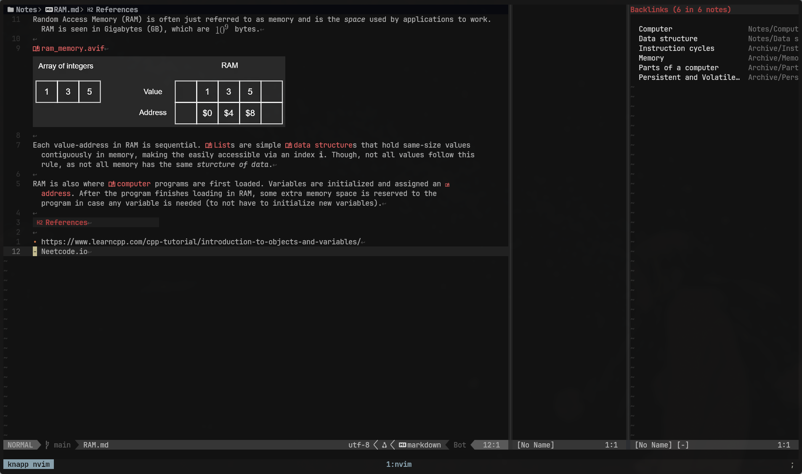
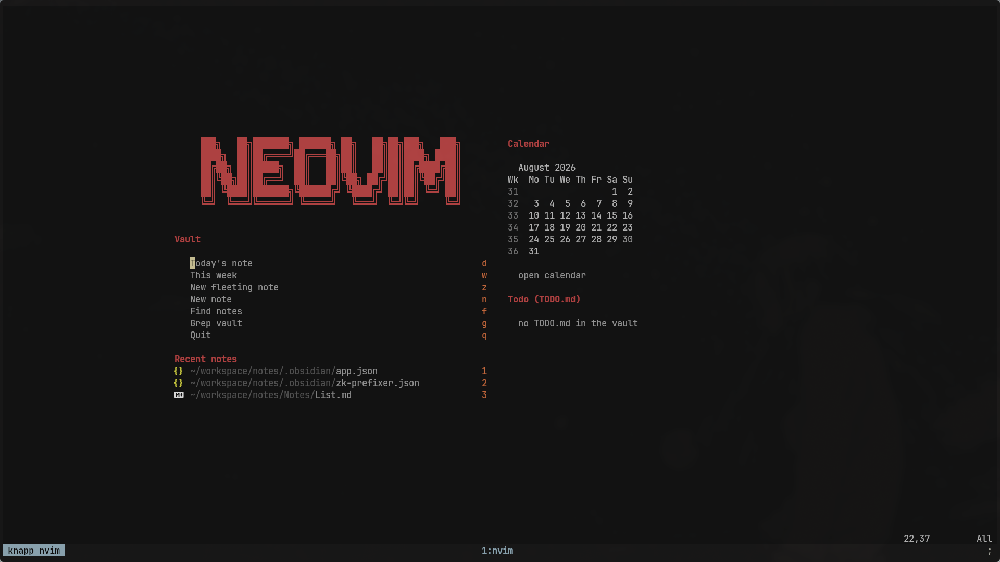
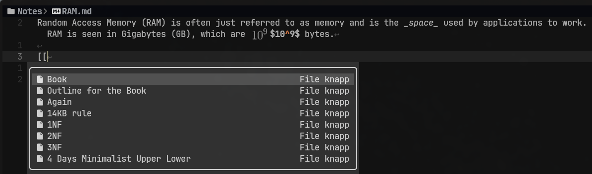

# knapp.nvim

> [!WARNING]
> This plugin was made with extensive use of AI for my specific use-case for a
> Neovim-Obsidian setup, so if you wish to work with it please bear that in mind.

<p align="center">
  
</p>

[Knapping](https://en.wikipedia.org/wiki/Knapping) is the craft of shaping obsidian by striking flakes off it. That is
roughly what this does to a vault. `knapp` is designed to work alongisde an [Obsidian](https://obsidian.md) vault, and it tries
to emulate a lot of the behavior Obsidian has that makes it compelling to use as an interface
for Makrdown note-taking:

- **Vault indexing**. It keeps tracks of notes with their backlinks and paths, making it
  easy to rename, merge, and move around files and update links automatically.
- **Plugin-compatible**. It makes use of the configuration for the daily, weekly, and unique
  notes
- **Command palette**. Just an easy way to have all the actions at the use of a
  single keymap.
- **Readable-width**. The `wrap.pad` option can be used to generate an artificial padding
  that emulates how Obsidian created a width comfortable for reading.

This plugin requires Neovim 0.11+ and a vault created by Obsidian, as it reads the
contents of `<vault>/.obsidian/*.json`. This makes it easy to keep both systems in sync
without having to configure them twice:

- `app.json`. New-note and attachments directory
- `daily-notes.json`. Daily note folder, format and template.
- `templates.json`. Templates directory, date and time formats.
- `plugins/calendar/data.json`. Weeknly note directory, format, template and week start.
- `zk-prefixer.json`. Zettelkasten prefixer for directory, timestamp format and template.

> The idea is to be able to make use of this plugin independenlty of Obsidian

## Install

With `vim.pack` (Neovim 0.12+):

```lua
vim.pack.add({
  {
    src = "https://github.com/MoXcz/knapp.nvim",
    version = vim.version.range("^0.2"),
  },
})

require("knapp").setup({
  vault = "~/notes", -- required
})
```

> Omit `version` to track `main`.

With lazy.nvim:

```lua
{ "MoXcz/knapp.nvim", opts = { vault = "~/notes" } }
```

It's recommended to run `:checkhealth knapp` at a first run to se which files the plugin
found, and any missing dependencies you might want.

### Used plugins

- [snacks.nvim](https://github.com/folke/snacks.nvim). Used as the picker backend for the command pallete, note finder
  and vault grep. It's also use to present a [dashboard](#dashboard). If the plugin isn't
  present the picker uses `vim.ui.select` and the dashboard isn't available.
- [blink.cmp](https://github.com/Saghen/blink.cmp). Used as the completion source so that when `[[` is used the vault
  notes are displayed. Without it there's no completion.
- [render-markdown.nvim](https://github.com/MeanderingProgrammer/render-markdown.nvim). Live markdown preview.
- `ripgrep`. Fast vault grep, fallback to `grepprg`.
- `snacks.image`. Used to render images and LaTeX similar to Obsidian's live-preview.

The recommended setup is that if you don't have a vault, to [install Obsidian](https://obsidian.md/download) to create a
new vault and configure `Daily Notes`, `Templates`, `Unique note creator`, and installing the
`Calendar` community plugin and configure that as well.

## What it does

**Link index.** One pass over the vault builds name -> file and file ->
backlinks maps, cached and mtime-checked (~450ms cold, ~85ms warm on 3.6k
notes). Understands `[[note]]`, `[[note|alias]]`, `[[note#heading]]`,
`[[note#^block]]`, `![[embed]]` and `[text](note%20name.md)`, resolves bare
names the way Obsidian does (closest file wins), reads `aliases:` frontmatter,
and ignores links inside fenced blocks and inline code.

This also means that renaming, moving or merging notes also rewrites all links
that pointes to it. Bare-name links stay bare while the name is unambiguous,
path-style links get repathed, and links that went through an alias are left
alone because the alias still resolves. Notes with unsaved changes are never
touched silently - they are reported instead.

**Merge.** Appends the whole note to another, repoints the backlinks and moves
the original to the vault's `.trash`.

**Journal.** Daily, weekly and zettel-prefixed notes using the folders, date
formats and templates from Obsidian's own settings, including a moment-style
formatter (`YYYY-[W]ww`, `Y-MM-DD dddd`, ...) and template placeholders
(`{{title}}`, `{{date:FMT}}`, `{{date+6d:FMT}}`).

**Calendar.** A month grid marking the days that already have a note. `<CR>`
opens that day, `W` opens the week.

**Existing vs missing links.** Every link is highlighted by whether it
resolves: `KnappLink` when the target exists, `KnappLinkMissing` when it does
not, so a typo in a note name shows up without following it. Both are defined
with `default = true`, so a colorscheme that sets them wins. `<prefix>x` (or
`:Knapp missing`) puts every dead link in the current note in the quickfix
list.

**Backlinks pane.** Opens with the note, refreshes as you move between notes,
one row per linking note with an occurrence count.

**Readable width.** Neovim soft-wraps at the window edge and has no wrap-at-
column option, so the note window is narrowed to `wrap.width` and the leftover
space is filled with an inert padding window that window motions skip over.

## Keymaps

Buffer-local inside the vault, all under `keys.prefix` (default `<leader>o`):

| Key                         | Action                                                                      |
| --------------------------- | --------------------------------------------------------------------------- |
| `gf`                        | follow link, jump to `#heading` / `#^block`, offer to create a missing note |
| `<C-p>`                     | command palette                                                             |
| `<prefix>b` `i` `c` `l` `h` | bold, italics, code, wikilink, highlight (toggles)                          |
| `<prefix>r` `m` `M`         | rename, move, merge                                                         |
| `<prefix>B` `Q`             | backlinks pane, backlinks in quickfix                                       |
| `<prefix>x`                 | missing links in this note, in the quickfix list                            |
| `<prefix>n` `f` `g` `t`     | new note, find notes, grep vault, insert template                           |
| `<prefix>R` `W`             | rebuild index, toggle readable width                                        |

Global, since a journal note is often opened from outside the vault:
`<prefix>d` today, `<prefix>y` yesterday, `<prefix>w` this week, `<prefix>z`
new fleeting note, `<prefix>C` calendar.

Insert mode gets `<C-b>` bold and `<C-l>` wikilink. `<C-i>` italics is opt-in
(`keys.swap_ci`): terminals send `<C-i>` as `<Tab>`, so it only works under the
kitty keyboard protocol, and it also maps `<C-k>` to jumplist-forward.

Every action is also a `<Plug>` mapping, so nothing above has to be accepted as
given:

```lua
-- rebind one action; knapp then leaves its own default for it alone
vim.keymap.set("n", "<leader>rn", "<Plug>(KnappRename)")

-- or take none of the defaults and bind what you want
require("knapp").setup({ vault = "~/notes", keys = { enabled = false } })
vim.keymap.set("n", "<leader>k", "<Plug>(KnappPalette)")
```

The `<Plug>` names are `Knapp` plus the action: `Follow`, `Palette`, `Bold`,
`Italic`, `Code`, `Link`, `Highlight`, `InsertBold`, `InsertLink`,
`InsertItalic`, `Rename`, `Move`, `Merge`, `BacklinksPane`, `BacklinksQf`,
`MissingLinks`, `NewNote`, `FindNotes`, `GrepVault`, `Reindex`, `ToggleWidth`,
`InsertTemplate`, `Daily`, `Yesterday`, `Weekly`, `Zettel`, `Calendar`.

Defaults are only bound where you have not already bound the matching `<Plug>`
yourself (`hasmapto()`), so rebinding one action does not leave a stray default
behind. `keys.global = false` drops the five journal keymaps that would
otherwise exist outside the vault.

`:Knapp <subcommand>` covers the same ground with completion: `palette`,
`rename`, `move`, `merge`, `backlinks`, `follow`, `new`, `find`, `grep`,
`index`, `daily [offset]`, `weekly [offset]`, `zettel`, `calendar`,
`template`, `pane`, `width`, `missing`, `dashboard`, `todo`.

## Configuration

Defaults:

```lua
require("knapp").setup({
  vault = nil, -- required
  ignore = { ".obsidian", ".trash", ".git", ".stfolder" },
  keys = {
    enabled = true,  -- false: no defaults, <Plug> maps still defined
    global = true,   -- false: journal keys only inside the vault
    prefix = "<leader>o",
    palette = "<C-p>",
    insert = true,   -- insert-mode <C-b> / <C-l>
    swap_ci = false, -- <C-i> italics + <C-k> jump forward (kitty only)
  },
  wrap = {
    enabled = true,
    width = 120,
    pad = true,                  -- false: wrap at the window edge
    min_pad = 4,
    display_line_motions = true, -- j/k walk display lines
    -- run when a window motion leaves the far side of the padding window;
    -- ignored unless the command exists, so these are inert without
    -- vim-tmux-navigator
    nav_commands = {
      h = "TmuxNavigateLeft",
      l = "TmuxNavigateRight",
      j = "TmuxNavigateDown",
      k = "TmuxNavigateUp",
    },
  },
  backlinks = {
    enabled = true,     -- false: no pane, no auto-open, no BufEnter work
    auto = true,
    position = "right", -- "right" | "left" | "top" | "bottom"
    width = 40,         -- "left"/"right"
    height = 10,        -- "top"/"bottom"
  },
  journal = {
    enabled = true,           -- false: no daily/weekly/zettel commands or keys
    zettel_separator = " - ", -- "<timestamp> - <title>.md"
  },
  calendar = {
    enabled = true, -- false: no calendar command, key or dashboard section
  },
  dashboard = {
    enabled = true,      -- needs snacks.nvim
    auto = true,         -- open on startup, inside the vault only
    todo = "TODO.md",    -- vault-relative file to read `- [ ]` tasks from
    todo_limit = 10,
    recent_limit = 8,
  },
  links = {
    enabled = true,  -- highlight links by whether their target exists
    debounce = 150,  -- repaint at most this often while typing, ms
  },
  -- 'sessionoptions' contains "blank", which stores the plugin's scratch
  -- windows in sessions and brings them back empty after :restart
  fix_sessionoptions = true,
  cache = vim.fn.stdpath("cache") .. "/knapp",
})
```

## Lua API

Two functions are public, stable API. Everything else under `lua/knapp/` may
change without notice.

- `require("knapp.palette").register(name, fn)` adds an entry to the command
  palette. Call it from your config after `setup()`:

  ```lua
  require("knapp.palette").register("Sync vault", function()
    vim.cmd("!git -C ~/notes pull --rebase && git -C ~/notes push")
  end)
  ```

- `require("knapp.index").resolve_file(target, from_rel)` resolves a link
  target the way `gf` does -- notes through the index, then attachments and
  other literal files in the vault -- and returns an absolute path or nil.
  `from_rel` is the vault-relative path of the note the link appears in; it
  breaks ties when several notes share a name. The `snacks.image` snippet
  below is built on it.

## Development

```sh
make deps    # install busted into ./.luarocks (not into $HOME)
make tools   # download selene into ./.tools
make test    # run the suite
make bench   # time the index against a synthetic vault
make lint    # stylua --check and selene
make typecheck # lua-language-server against .luarc.json
make help    # everything else
```

Specs run inside Neovim via `nvim -l`, so they get the real `vim` API with no
stubbing. `make test BUSTED_ARGS=tests/link_spec.lua` runs one file.

`:checkhealth knapp` reports the config, the `.obsidian` files knapp reads, and
the index state.

## Dashboard



With [snacks.nvim](https://github.com/folke/snacks.nvim), starting Neovim with
no file inside the vault opens a dashboard: shortcuts for today's note and the
journal, the notes you opened most recently, this month's calendar with the
days that already have a note marked, and the unfinished tasks from a file in
the vault.

It only opens when the working directory is inside the vault and no file was
given, so `nvim` anywhere else — and whatever dashboard you already use there —
is untouched. `:Knapp dashboard` opens it on demand.

The todo list reads `- [ ] task` lines from `dashboard.todo` (`TODO.md` at the
vault root by default), skipping anything inside a fenced code block. Selecting
a task opens the file on that line, and `:Knapp todo` opens it directly.

```lua
dashboard = {
  enabled = true,
  auto = false,          -- only open it with :Knapp dashboard
  todo = "Journal/Tasks.md",
  todo_limit = 10,
  recent_limit = 8,
},
```

## Completion



`[[` can complete note names from the vault, the way Obsidian's link
autocomplete does. Register the source with
[blink.cmp](https://github.com/Saghen/blink.cmp):

```lua
sources = {
  -- add it for markdown only; `inherit_defaults` keeps your usual sources
  per_filetype = {
    markdown = { inherit_defaults = true, "knapp" },
  },
  providers = {
    knapp = { name = "knapp", module = "knapp.blink", score_offset = 100 },
  },
}
```

It only offers completions inside a vault note, and only between an unclosed
`[[` and the cursor. Picking an entry inserts the bare note name when that
name is unambiguous and the vault-relative path when it is not, the same rule
knapp uses when rewriting links, and closes the brackets unless they are
already there.
